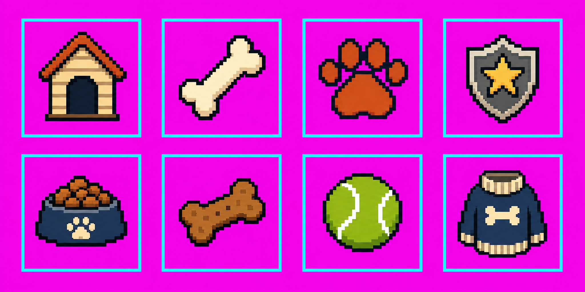
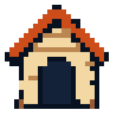
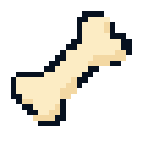
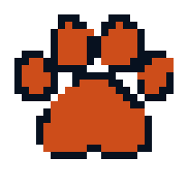
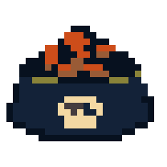
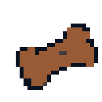
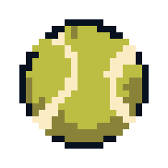
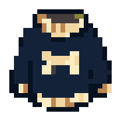
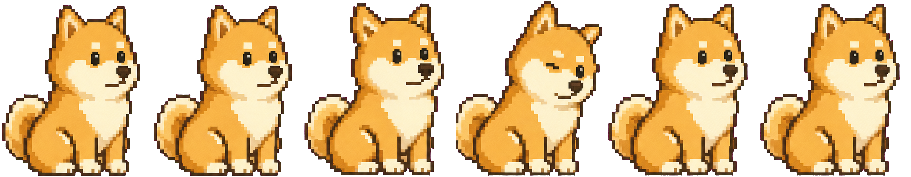

# Magic Assets

[English](#why-your-vibe-coded-pages-still-smell-like-ai) · [中文](#为什么你vibe-coding的页面总是一股ai味儿)

---

## Why your vibe-coded pages still smell like AI

“Frontend is dead!”

You shout it, drop the vibe-coded page on your boss, and watch their face fold: “Yeah… Codex / Claude Code did this, right?”

Codex likes to paste its own build slogans onto the page, a kind of unvarnished teenage beauty. Claude Code cannot leave a rounded, low-contrast box alone — it always looks like a PowerPoint template from ten years ago.

AI coding tools do not make ugly pages. They make pages with no soul. I have stared at Claude Code and Codex until three words squeezed out of the source: **no artist**.

You want a cute pet shop. Codex does not care. Cement-gray background, a nauseous green pad, icons forever borrowed from Ant Design. If it throws in an emoji you are supposed to say thank you.

A real art pass is not something a prompt can replace.

The good news is it is not hopeless. Pair Image2’s tight generation with a grid constraint and a few edge-processing tricks, and you can ship original assets fast.

Magic Assets is that idea as a skill. It sits inside the frontend vibe-coding loop and draws what the page actually needs: hero icons, hi-res banners, character loops, pixel animation — enough to make a page look designed, not generated.

Here is a real case.

## Generating assets

Magic Assets (MA) currently has five pipelines:

| Path | For |
| --- | --- |
| **FX** | Pulse, bob, shake, flash, fade, mask. CSS + a tiny JS helper. No new pixels. |
| **Grid** | A family of equal-size clay / flat icons |
| **Pixel** | Equal-size pixel icons: PNG + crisp SVG |
| **Pixel-anim** | One character, 4 painted frames → GIF / strip / CSS cycle |
| **Mixed** | One large hero plus smaller matching props |

Say you are building a pet shop and you tell the agent you want pixel art. MA takes the **pixel** path, paints a themed sheet, and cuts it to SVG.

The raw sheet gets a hard chroma background and edge marks so the cut is precise:



The shelf icons after the cut:










kennel · bone · paw · badge · kibble · treat · ball · sweater

And yes — MA can build pixel animation.

It paints four frames, packs them into a strip, plays them with CSS `steps()`, then wraps a slow bob around it. You get a little Shiba behind the counter:



MA also writes `fx.css` / `fx.js` from the finished assets, so the motion drops into the page without loading the raw sheet.

Using Magic Assets is straightforward.

## Quick start

```bash
git clone <this-repo>
cd magic_asset
python3 -m pip install -r requirements.txt
```

Fill in `magic-assets/ma_settings.json`:

```json
{
  "endpoint": "your provider endpoint",
  "apikey": "your-key",
  "model_name": "gpt-image-2"
}
```

## Notes

A **brief** is a small JSON job: names, style, frames, effect ids. Sesame Shop’s briefs live in [`example_web_design/briefs/`](example_web_design/briefs/). Scratch jobs can sit in repo-root `briefs/` (gitignored).

The agent reads [`magic-assets/SKILL.md`](magic-assets/SKILL.md). When you install into another project, copy **that folder only** — not this README, not the demo.

## What’s next

Next I will push the motion pipeline further, so MA can author effects that feel designed — not just a bob and a flash.

---

# Magic Assets · 中文

## 为什么你Vibe Coding的页面总是一股AI味儿

“前端已死！”

当你喊着这个口号，把你vibe coding做出来的页面丢给老板，对方面露难色：“嘶，你这页面是codex/claude code做的吧？”

codex喜欢把自己开发过程像标语一样贴在你的网页里，让你的网页透漏出一种未成年的未经雕琢之美；claude code执着于圆角低对比度的方框设计，看起来总有种10年前ppt模版的感觉。

AI coding tools 做出来的页面不能说难看，但是就是缺乏一点灵性，我翻来覆去睡不着，把claude code和codex看了又看，代码之间挤出来三个字：“缺美工”

没错，你想做一个可爱的宠物主题商城，codex管你那个，水泥灰背景加屎绿色pad，主打一个不着调，icon永远是Ant Design里的组件，偶尔给你加一个emoji你都得说一句谢谢gpt哥哥。

总之，一个好的美术，是无论什么prompt都替代不了的。

好在事情无绝对，只要配合Image2强大精确的生图的能力，在生成图像时，加入网格约束，再结合一些边缘处理的小trick，就可以快速生成各种素材。

Magic Assets就是基于此想法开发的。作为一个skill，他能和前端vibe coding管线深度融合，根据实际开发需要，生成主体icon、高清banner、人物动图、像素风格动画，足够开发出好看又有个性的页面设计了。

接下来我用一个实际开发的case来详细介绍下 Magic Assets具体做了什么。

## 生成素材

Magic Assets（MA）目前分为5种生成管线

| Path | 用来干什么 |
| --- | --- |
| **FX** | 呼吸、浮动、抖动、闪出、淡入、蒙版。CSS + 一小段 JS。不需要新像素。 |
| **Grid** | 一套同尺寸的粘土 / 扁平图标 |
| **Pixel** | 同尺寸像素图标：PNG + 硬边 SVG |
| **Pixel-anim** | 一个角色，4 帧 → GIF / 横条 / CSS 循环 |
| **Mixed** | 一个大主视觉，配一组小道具 |

比如，在构建一个宠物主题的商城网站时，如果你告诉 Agent 你更喜欢像素风格，MA 会通过 pixel path，生成一套主题元素图，并切成 SVG：

生成的原始图会做背景强化和边缘处理，让后续的切割更加精确：


切出来的货架图标：


狗窝 · 骨头 · 爪印 · 徽章 · 主粮 · 零食 · 网球 · 毛衣

另外，别忘了MA是可以构建像素动画的！

通过生成 4 帧图，裁好打成横条。CSS 按帧播放，外面再包一层慢慢的 bob，就会出现一只可爱的柴犬：


同时，MA会根据处理后的素材生成 `fx.css` / `fx.js`，这样可以更好的容易代码，不再需要加载原始图片。

Magic Assets的使用也很简单！

## 快速开始

```bash
git clone <this-repo>
cd magic_asset
python3 -m pip install -r requirements.txt
```

填写 `magic-assets/ma_settings.json`：

```json
{
  "endpoint": "your provider endpoint",
  "apikey": "your-key",
  "model_name": "gpt-image-2"
}
```

# 一些补充

**Brief** 是一份小 JSON：名字、风格、帧、动效 id。芝麻铺的 brief 在 [`example_web_design/briefs/`](example_web_design/briefs/)。你自己的临时任务可以丢在仓库根的 `briefs/`（已 gitignore）。

Agent 读的是 [`magic-assets/SKILL.md`](magic-assets/SKILL.md)。拷到别的项目时 **只拷这个文件夹**，不要把 README 和演示站一起带走。

## 下一步的计划

下一步我计划将进一步完善动效素材的生成和处理，让MA具有创作更有设计感更酷炫特效的能力。
